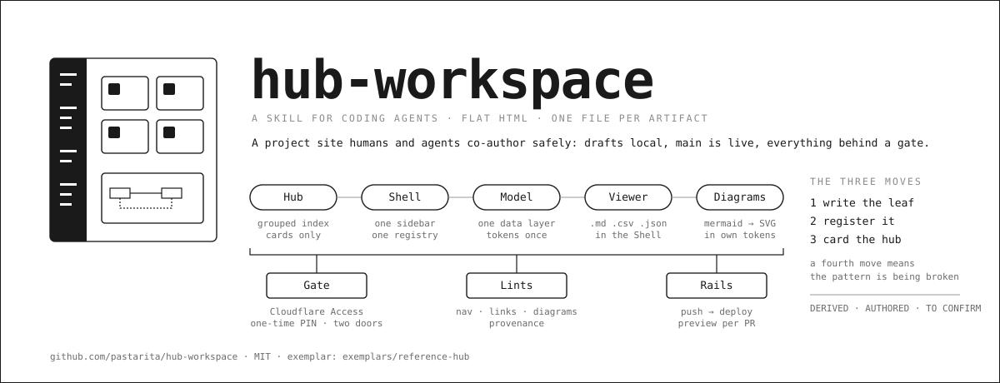

# hub-workspace



**Live demo:** https://hub-workspace.pages.dev is this pattern applied to itself: the skill's own
documents rendered through its Viewer, inside its Shell, with the diagram reader drawing the
mermaid in them. The demo runs with the Access gate switched off so the link works for everyone;
a banner on the site says so. A real deployment sits behind Cloudflare Access with One-time PIN.

A skill for coding agents (Claude Code, and anything else that reads a `SKILL.md`) that builds
and maintains a **hub workspace**: a flat-HTML project site that humans and agents co-author
safely. One grouped index, one shared collapsible sidebar, one data layer, custom glyphs per
page, a polyglot viewer for the markdown and CSV that live beside the HTML, a mermaid reader
typeset in the site's own tokens, print-destiny leaves, an edge gate (Cloudflare Access with
One-time PIN, Basic auth beside it), and CI that deploys every push to Cloudflare Pages with
a preview URL per pull request.

The pattern optimizes for three things at once: **agent legibility** (every artifact is one
readable, writable file), **operator legibility** (navigation mirrors the phases of the work),
and **collaboration safety** (drafts local, main is live, everything behind a gate).

## Install

As a global skill for Claude Code:

```sh
git clone https://github.com/pastarita/hub-workspace ~/.claude/skills/hub-workspace
```

Vendored into one repository, so every agent working there loads the same pattern:

```sh
git subtree add --prefix .claude/skills/hub-workspace https://github.com/pastarita/hub-workspace main --squash
# later:
git subtree pull --prefix .claude/skills/hub-workspace https://github.com/pastarita/hub-workspace main --squash
```

Then ask the agent to "build a hub workspace", "add a leaf", "put Access on it", or "audit
the routes". `SKILL.md` is the contract; `references/` hold the runbooks and templates it
points to.

## What is in here

| Path | What |
|---|---|
| `SKILL.md` | The pattern: vocabulary, the three moves, design-system discipline, provenance, the gate, re-entry surfaces, anti-patterns. |
| `references/templates.md` | Scaffold checklist and copy-paste skeletons: leaf, Shell, gate, CI, re-entry set, provenance badge. |
| `references/access-runbook.md` | Cloudflare Access, first and always: the exact dashboard click path, reading the AUD from the redirect, verifying, the failure table. Written to be driven by browser automation. |
| `references/collaborator-access.md` | The three gate tiers, when to graduate, and the eleven rules that make a self-service door safe. |
| `references/polyglot-viewer.md` | The one Viewer for `.md` / `.csv` / `.json` / `.jsonl`, and the bugs its first drafts shipped. |
| `references/derived-layer.md` | Authored model, generated derived file, generator and verifier: how numbers stay true. |
| `references/symbolic-system.md` | Register, cluster registry, glyph minting, status glyphs, stable handles. |
| `references/estate.md` | The tier above one hub: federated and layered estates. |
| `reviews/` | Dated audits of real builds against the pattern. |
| `exemplars/reference-hub/` | A complete working instance with its own paper-base design system: Shell, tokens, Viewer, the mermaid reader (`site/diagram.js`), the two-door gate (`functions/_middleware.js`), the lints, stage and preview scripts, the Access setup script, and the CI workflow. |

## About the exemplars

The one exemplar that ships, `exemplars/reference-hub/`, is cited by relative path. The other
recipes are described in enough detail to build from.

## The mermaid reader

`exemplars/reference-hub/site/diagram.js` reads the mermaid subset a documentation set actually
uses and renders SVG in the site's tokens, with no dependency: flowcharts in four directions
with nested subgraphs, edges to and from a subgraph, six node shapes, five edge styles, fan-out,
bidirectional edges, self-loops, serpentine wrapping for long chains; sequence diagrams with
loops and notes; git graphs with branches, merges, tags and reverts; state diagrams with
composite states; class diagrams with realization and dependency. Colour comes from the class
name, never from `classDef` hex, so tokens keep one source. `tools/check-diagram.mjs` renders
every fence in a site in CI.

## License

MIT. See `LICENSE`.
