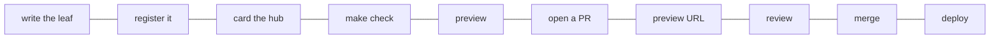
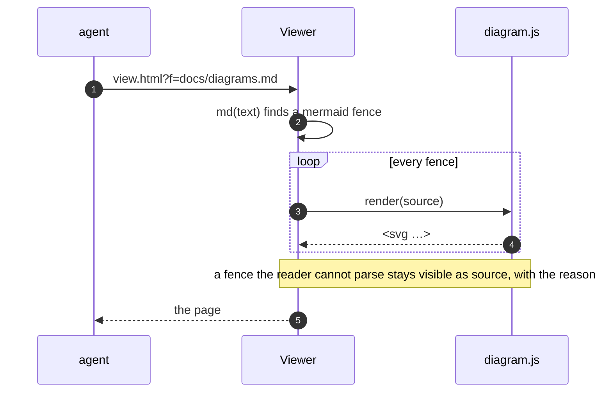
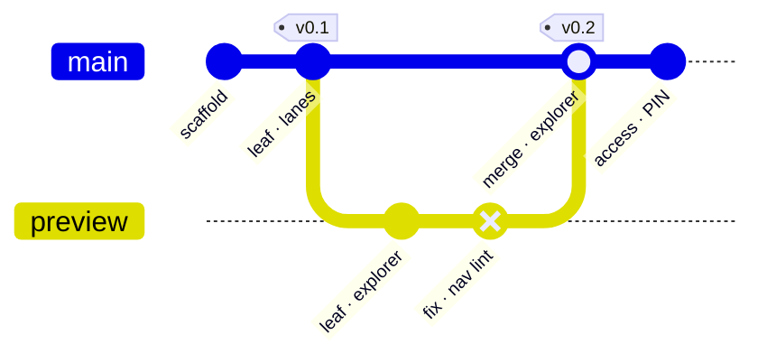
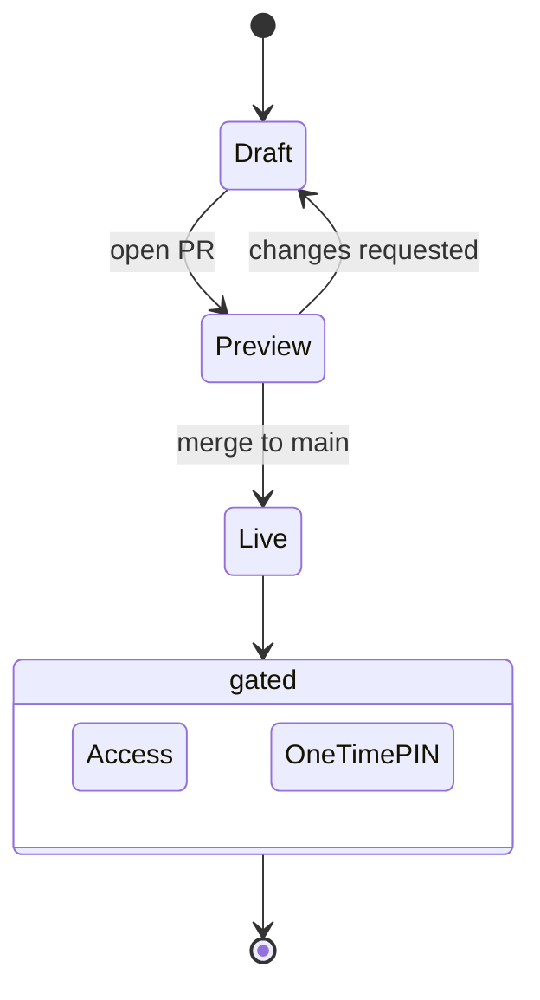
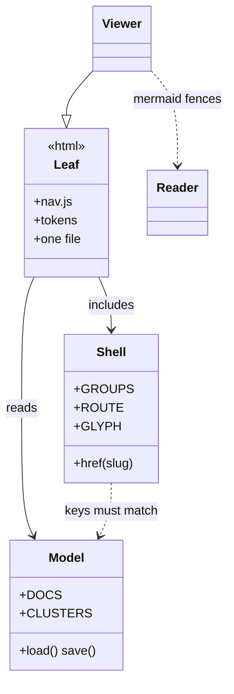

# Diagram reader demo

Every diagram on this page is a plain mermaid fence in the markdown. The Viewer hands each one to
`site/diagram.js`, which reads the subset below and renders SVG in the site's tokens. There is no
mermaid library on this page. Colour comes from the class *name* (`:::hub`), never from the hex
in `classDef`, so the tokens keep one source. Flow kind is line style, never colour alone.

## Flowchart with subgraphs, six shapes, five edge styles

```mermaid
flowchart LR
  subgraph IN["inputs · what arrives"]
    direction TB
    A[document]:::data
    B[(records)]:::store
    C[/stream/]:::data
  end
  subgraph H["the hub"]
    direction TB
    Sh[Shell]:::hub --> M[Model]:::model --> L[leaf]:::leaf
    L ==>|state| M
  end
  subgraph OUT["outputs"]
    direction TB
    S([surface]):::surface
    F{{gate}}:::gate
    R((print)):::rails
  end
  A & B & C --> H
  H --> S & F
  L -.->|"cold leaves"| R
  IN -.- OUT
  classDef hub fill:#000
```

## A long chain wraps serpentine

## Sequence

## Git graph

## State diagram

## Class diagram

